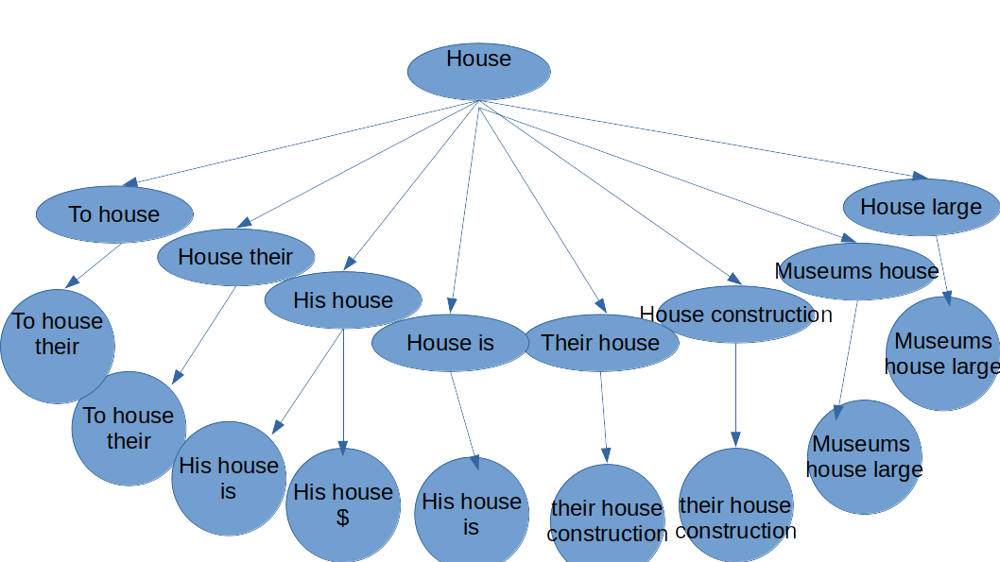

# Suggestions Trie

For every language pair for which we have translation projects or previously available parallel aligned data, we will have a translation memory learned model. When we encounter a word in a particular context, we use this learned model to get all possible translations of the word and get them scored based on the current context window. These scored translation can be given to user as suggestions. The Trie data structure is what we use to store this context and translations effiently.

## Tire structure for Vachan

* Have one trie per source-target language pair, this would reduce the size and thus increase search performance at level 1
* Each node will have
	* a key: the context. The window size increases by one at each level
    * translations: list of all seen translations and their count for the given context. The count and current level can be used for scoring suggestions(score = level*count/total_occurances, total_occurance=sumOfCountsAtLevel1)
    * children: context increases by one word to right or left from the current context

input:
```
[
{"token": "house","context":"They use barrels to house their pets","translation":"പാര്‍പ്പിക്കുക"},
{"token": "house","context":"His house is to the left","translation":"വീട്"},
{"token": "house","context":"Their house contruction methods are different","translation":"ഭവന"},
{"token": "house","context":"Last time I went to his house,","translation":"വീട്ടിലേക്ക്"},
{"token": "house","context":"Museums house large collection of Roman sculpture","translation":"ഉള്‍ക്കൊള്ളുന്നു"}
]
```

A trie of window size 3 trie, showing only the the conceptual keys at each node for the above input data. 




The actual trie, the way the above concept is realised for an input set of data shown here, would look like the tree structure shown below.
```
training_data = [
    ("bank", ["bank", "is", "closed"], "ബാങ്ക്"),
    ("bank", ["they", "bank", "on", "us"], "ആശ്രയിക്കുക"),
    ("bank", ["pay", "bank", "back"], "ബാങ്ക്"),
    ("bank", ["river", "bank", "is", "muddy"], "തീരം"),
    ("bank", ["Ganga","has", "wide" , "bank", "on", "sides"], "തീരം"),
    ("bank", ["bank", "manager", "spoke"], "ബാങ്ക്"),
    ("hare", ["a", "hare", "is", "same", "as", "rabbit"], "മുയല്‍")]
```
In the above training data we see 5 instances on the token "bank" coming in different contexts with two different translations. Also we see a second token "hare" occuring in its own context.

When we build trie we convert the context window into a slighlty different sequence that starts at the token of interest and grows to either side. To indicate that a context word occurs to the right or left of the token, we append R or L to it.
```
	- bank	- R:is	- R:closed =>  {'ബാങ്ക്': 1.0}
	- bank	- R:is	- L:river	- R:muddy =>  {'തീരം': 0.5}
	- bank	- L:they	- R:on	- R:us =>  {'ആശ്രയിക്കുക': 0.5}
	- bank	- R:on	- L:they	- R:us =>  {'ആശ്രയിക്കുക': 0.5}
	- bank	- R:on	- L:wide	- L:has	- R:sides	- L:Ganga =>  {'തീരം': 0.25}
	- bank	- R:on	- L:wide	- R:sides	- L:has	- L:Ganga =>  {'തീരം': 0.25}
	- bank	- L:pay	- R:back =>  {'ബാങ്ക്': 0.5}
	- bank	- R:back	- L:pay =>  {'ബാങ്ക്': 0.5}
	- bank	- L:river	- R:is	- R:muddy =>  {'തീരം': 0.5}
	- bank	- L:wide	- R:on	- L:has	- R:sides	- L:Ganga =>  {'തീരം': 0.25}
	- bank	- L:wide	- R:on	- R:sides	- L:has	- L:Ganga =>  {'തീരം': 0.25}
	- bank	- R:manager	- R:spoke =>  {'ബാങ്ക്': 1.0}
	- hare	- L:a	- R:is	- R:same	- R:as	- R:rabbit =>  {'മുയല്\u200d': 0.5}
	- hare	- R:is	- L:a	- R:same	- R:as	- R:rabbit =>  {'മുയല്\u200d': 0.5}
```

For seeing the suggestion trie in action, refer the notebook [here](V2%20Translation%20Module.ipynb)