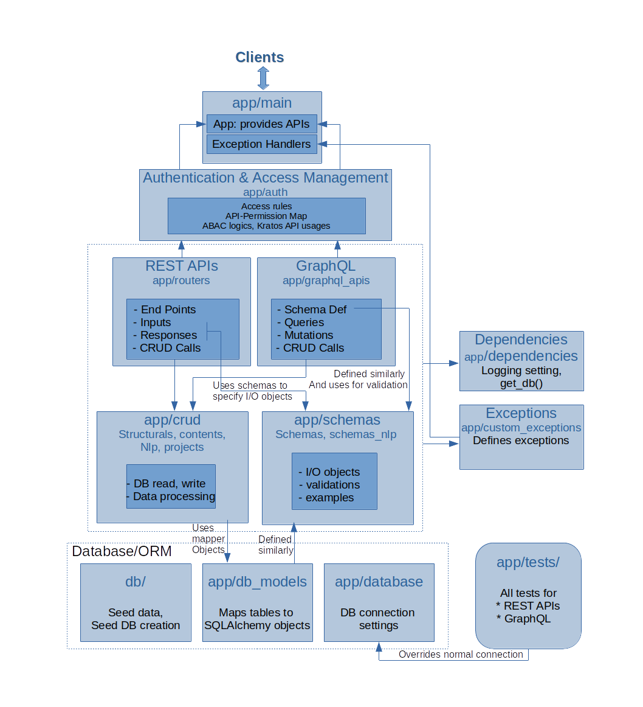

# Vachan-api Version 2
## Architecture

This document describes the high-level architecture of vachan-api. This is intended to guide you to familiarize yourself with the code base.

## Bird's Eye View

*context diagram*

vachan-api is the server application that provides REST APIs to interact with the underlying Databases (SQL and Graph) and modules in Vachan-Engine. Currently serving 3 client applications, VachanOnline website, the Vachan Mobile App and AutographaMT Bible translation tool.

Implemented Using
* Python 3.7.5
* Fastapi framework
* SQLAlchemy
* Postgresql Database
* DGraph Database

*Container diagram*

## Code Map

This section talks briefly about various important directories and files. It would give you ideas on where to find things you are looking for, in the code base.

### app/main

* Creates the fast api app, which can be started with `uvicorn main:app` from app folder
* Defines exception handlers, that make log entries and reformats the error responses to a uniform structure
* Make log entries
* Includes all API endpoints, defined in routers, to `app`.

### app/crud/

* Implements all read, write and update operations on database
* Performs various data processings before or/and after CRUD operations
* Three sub modules
> * structuals: which contain operations related to the predefined tables that make up the DB structure like Content_types, Languages, Licenses, versions, sources and bible_book_loopup
> * contents: which contain operations related to the content carrying dynamically created tables like bible, commentary, infographic, biblevideo, dictionary etc
> * nlp: which contain tables and operations related to AgMT stuff like tokenization, draft generartion, alignment, model building etc

### app/schemas

Contains all input output objects schema definitions, used by pydantic for input and response validations. Most of the API input-output types specified in the main module are defined here. The definitions specify
- type of each fields
- default values if any
- if the field is mandatory or optional
- example values to be displayed in API documentations

### app/routers

* Defines all API endpoints
* Specifies the types of path, query and body parameters of each API endpoint, which are used for input validations
* Specifies the output objects, messages and error objects returned by each endpoint, which are used for response validations
* Invokes the methods in CRUD module to perform functions required by each endpoint

*Component diagram*

### db/

* Contains the database creation script _seed_db.sql_ which should be run to set up the predefined database tables and add seed data to it while installing the app
* Contains the seed data for various tables as CSV files
* Contains instructions to setup the database
* Contains the database architecture diagram, that shows table schemas and relations(references)

### app/db_models

All SQLAlchemy mappings.
* Maps all predefined tables into alchemy objects
* Defines the table structure and mappings for dynamic tables

These mappings are done refering the schema definitions in `app/schemas` to make sure the field names are same in both, allowing automatic conversion between these.

### app/database

Establishes database connections. Make use of environment variables to connect to correct database using credentials.

### app/dependencies

Defines the `get_db()` function and `log` object used by other moudles like main, crud, routers etc

### logs/

* `logs` folder contains the API log files
* `app/dependencies` file has all the setting related to logging, such are file path, maximum size and number of log file etc.
* Most of the logging is done in the routers module while entering each API function and in exception handlers in main.

### app/custom_exceptions

Defines some of the exceptions like TypeException, NotAvailableException that are raised explicitly in code.

### app/tests

Contains all test cases defined. Uses pytest.
They are grouped based on API groups you see on swagger/redoc documentations.
The test files are named as test_groupname.py pattern. Each test function is independant of each other. So tests can be run in any desired manner as below

- All together (`python -m pytest` from app folder)
- One file at a time
- One or more test functions in a file using patterns(functions names)
